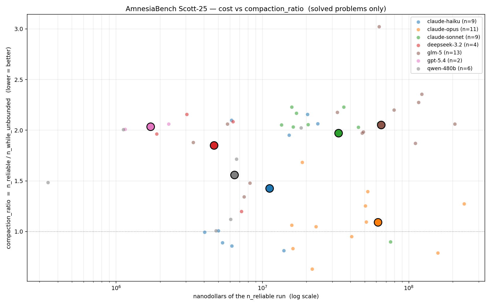
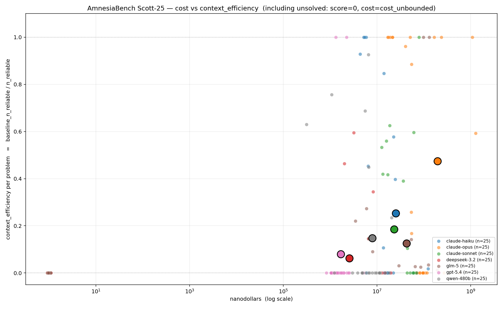
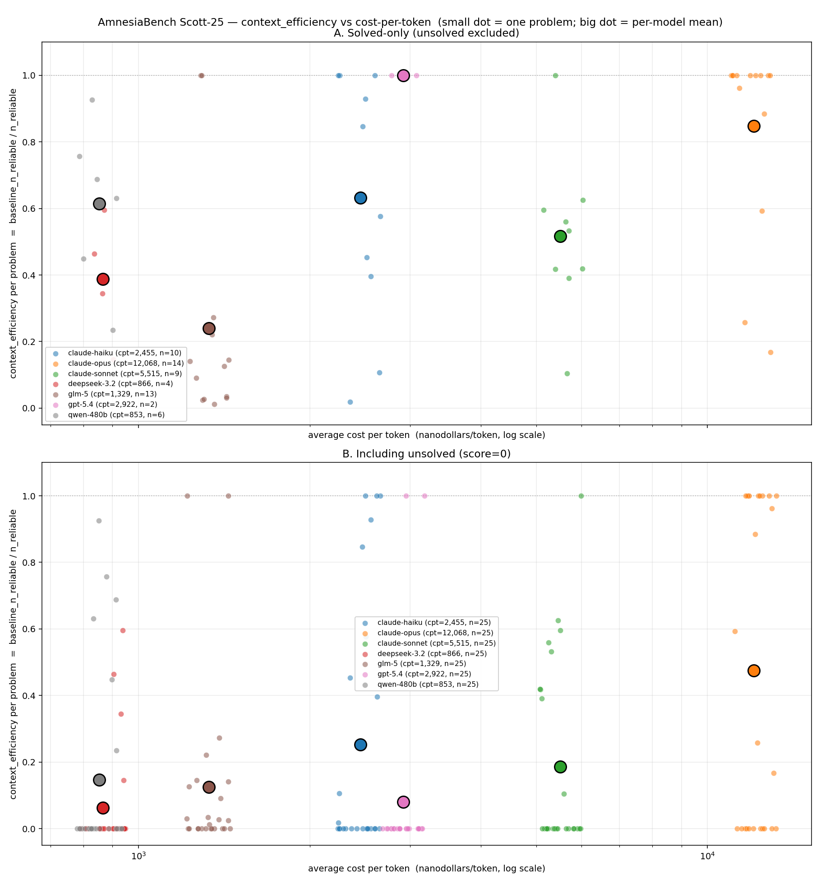
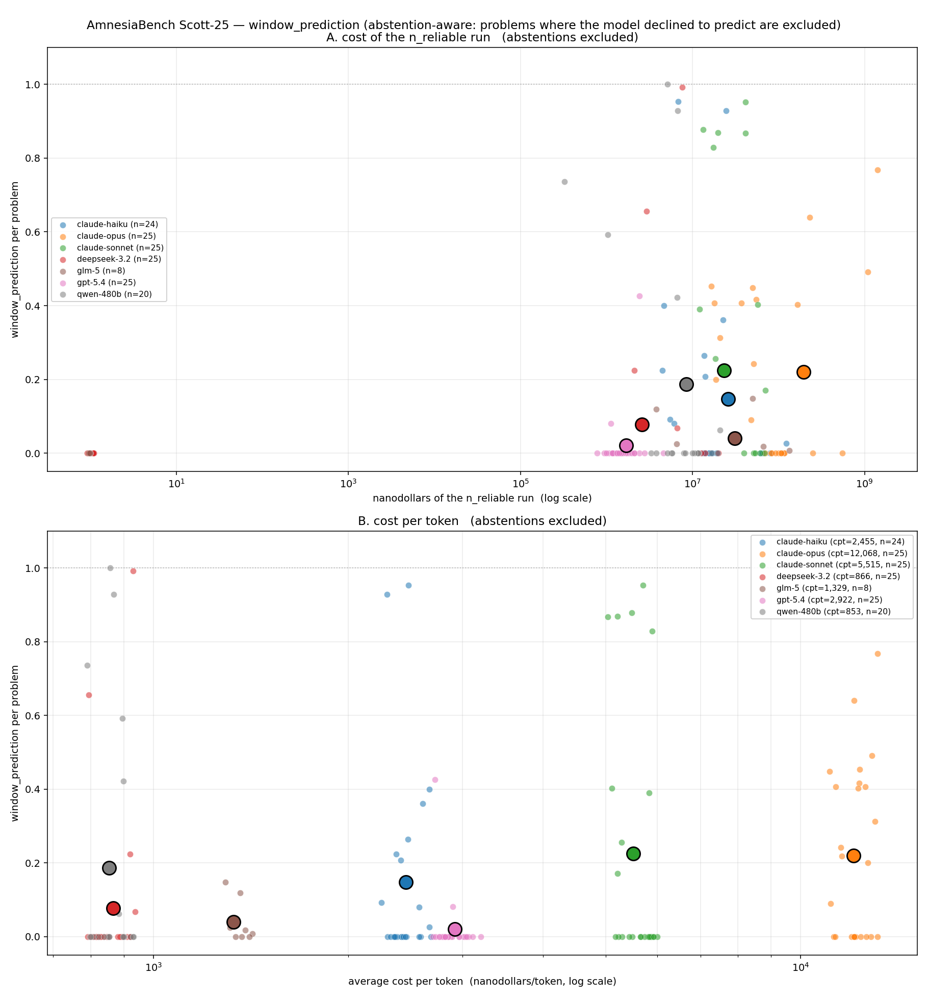
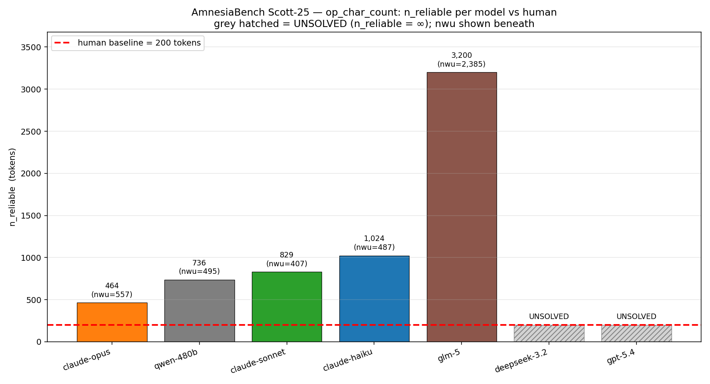
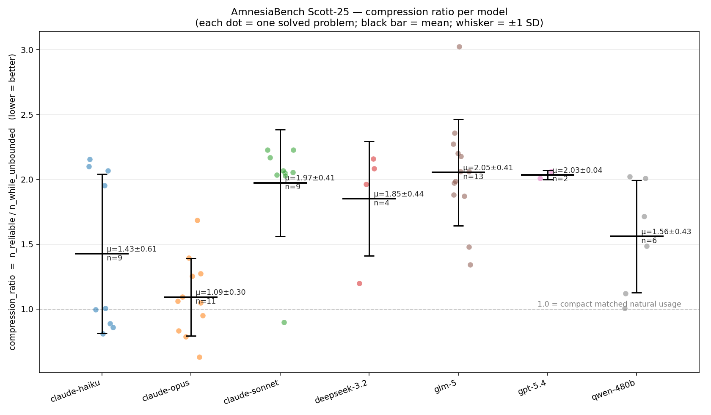
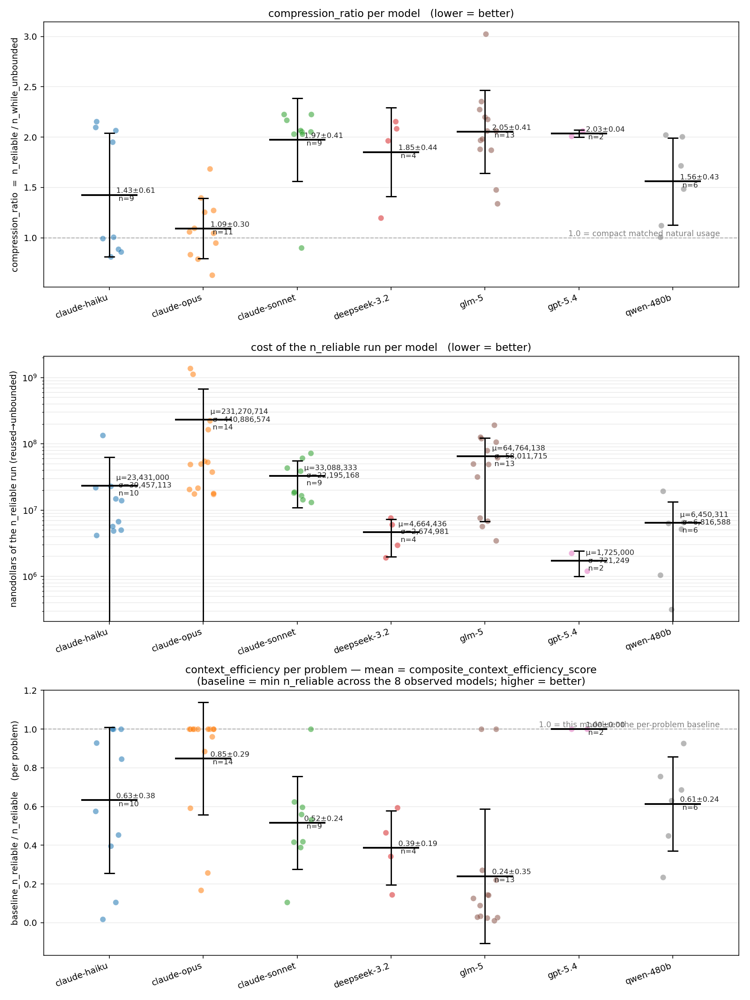
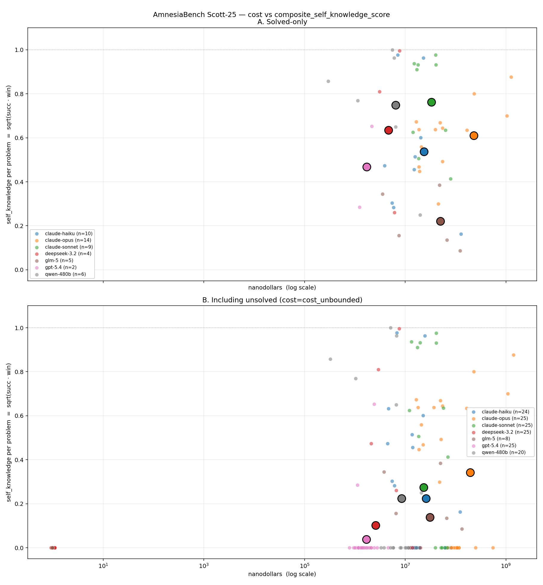
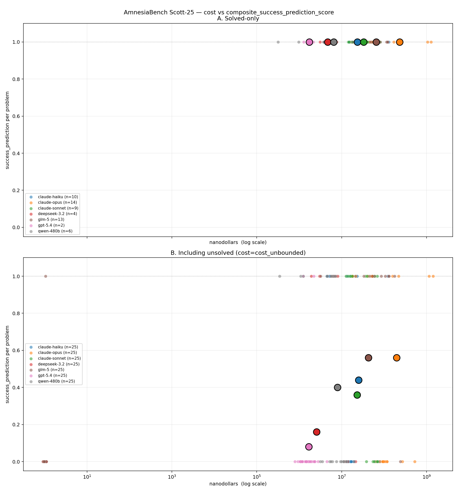

# AmnesiaBench — Scott 25 results

Local analysis of 7 frontier models × 25 problems from the
[AmnesiaBench Scott 25 Kaggle task](https://www.kaggle.com/competitions/amnesia-bench).

Each model ran the full pipeline: **unbounded → prediction → sweep →
binary search**. We recomputed `n_reliable` from the raw sweep /
binary-search trials (≥2/3 pass rule), then looked at how the models
compare on several axes.

Models: `claude-haiku`, `claude-opus`, `claude-sonnet`, `deepseek-3.2`,
`glm-5`, `gpt-5.4`, `qwen-480b`.
(`gemini-flash-2.5` was excluded from this run — see the data
sub-section at the bottom for why.)

---

## Headline table

| model            | solved | total cost | mean compaction_ratio ↓ | composite_ctx_eff (incl. unsolved) ↑ | composite_winpred (abstention-aware) ↑ |
|------------------|-------:|-----------:|------------------------:|-------------------------------------:|---------------------------------------:|
| claude-opus      |  14/25 |   $32.51   |                **1.09** |                              **0.47** |                                 0.22   |
| claude-haiku     |  10/25 |    $3.40   |                    1.43 |                                 0.25 |                                 0.15   |
| qwen-480b        |   6/25 |    $8.23   |                    1.56 |                                 0.15 |                                 0.19   |
| deepseek-3.2     |   4/25 |    $3.19   |                    1.85 |                                 0.06 |                                 0.08   |
| claude-sonnet    |   9/25 |   $42.40   |                    1.97 |                                 0.19 |                             **0.22**   |
| gpt-5.4          |   2/25 |    $0.14   |                    2.03 |                                 0.08 |                                 0.02   |
| glm-5            |  13/25 |    $4.15   |                    2.05 |                                 0.13 |                                 0.04   |

`compaction_ratio = n_reliable / n_while_unbounded` over solved
problems. Lower is better.

`composite_ctx_eff = baseline_n_reliable / n_reliable` averaged over
all 25 problems (unsolved → 0, cost_unbounded as cost). Baseline is the
minimum `n_reliable` across the 7 observed models per problem.

`composite_winpred` uses the abstention-aware rule: a model that
declines to predict (no finite `n_predicted`) is excluded from that
problem's window-prediction score, rather than penalized.

---

## 1. Cost vs compaction_ratio

- **claude-opus is the only model at the 1× floor.** Mean 1.09, tight
  spread (σ = 0.30), 11-problem sample.
- **claude-haiku beats every larger model except opus** (1.43) — the
  biggest surprise in the ranking.
- **gpt-5.4 is cheapest per defining run but not efficient** — only
  solved 2 problems and averages 2× overhead.
- **The cost axis spans ~2 orders of magnitude; the ratio axis spans
  ~2×.** Paying 100× more does not buy 100× better compaction.
- **Compaction actually helped (ratio < 1.0) on only 9/59 solved
  problems (~15 %).** Every one of those wins came from the claude
  family: haiku (4), opus (4), sonnet (1). For every other model,
  compaction is pure overhead — never a focusing mechanism.

---

## 2. Cost vs context_efficiency  (including unsolved)

Y-axis = `baseline_n_reliable / n_reliable` (unsolved → 0). Every
model has all 25 points: small dots = individual problems, big dot =
per-model mean.

- **claude-opus leads at 0.47.** It's the only model whose mean lifts
  above 0.2 once you include the problems it failed.
- **Everyone else bunches between 0.06 and 0.25.** 50× cost differences
  in that cluster don't predict meaningful score differences.
- **Solved-only vs. including-unsolved flips the ranking.** gpt-5.4
  hits 1.00 solved-only because on its 2 problems it *was* the
  baseline-setter. The honest view drops it to 0.08. Any model that
  aggressively abstains looks perfect on strict means and terrible on
  inclusive means.
- **Pareto frontier:** gpt-5.4 → qwen-480b → claude-haiku →
  claude-opus. Sonnet, glm-5, deepseek are all dominated.

---

## 3. Context_efficiency vs cost-per-token

Same Y-axis, but X is the model's **average cost per token**
(`sum(cost_nanodollars) / sum(tokens)` across all 25 problems). Since
cost-per-token is a per-model scalar, dots for a given model are
x-aligned.

- **Opus is ~14× more expensive per token than qwen-480b but only ~3×
  better on ctx_eff.** Sublinear scaling.
- **deepseek and qwen are priced near-identically (~850 nd/token) but
  qwen wins on both solved count and ctx_eff.**
- **Panel A** (solved-only) shows the "abstention reward" problem:
  gpt-5.4's tiny n biases it toward high-looking scores.

---

## 4. Cost vs window_prediction  (abstention-aware)

Window prediction = how close the model's self-predicted `n_predicted`
is to the measured `n_reliable`:

- ratio = `n_reliable / n_predicted`
- score = `ratio` if ≤ 1 (under-predicted, good)
- score = `(1/ratio)²` if > 1 (over-confident, soft penalty)
- score = 0 if the model committed a number but failed to solve
- **dropped from composite** if the model abstained (`n_predicted` is
  missing / infinite — the model said "I don't know how much I'll need")

Top panel: X = cost of the n_reliable run. Bottom panel: X =
cost-per-token.

**Abstention rates:**

| model | predicted | abstained |
|---|---:|---:|
| claude-opus | 25/25 | 0 |
| claude-sonnet | 25/25 | 0 |
| deepseek-3.2 | 25/25 | 0 |
| gpt-5.4 | 25/25 | 0 |
| claude-haiku | 24/25 | 1 |
| qwen-480b | 20/25 | 5 |
| **glm-5** | **8/25** | **17** |

**glm-5 declines to predict on 17/25 problems.** Before this
correction, those were counted as 0, dragging its composite to 0.01;
with the fix, the composite is 0.04. Still worst among committers,
but the gap to leaders shrank 3×.

**qwen-480b** also jumped from 0.15 → 0.19 once its 5 honest
abstentions stopped counting.

**Ranking after the fix:**

| model | winpred |
|---|---:|
| claude-sonnet | **0.22** |
| claude-opus | 0.22 |
| qwen-480b | 0.19 |
| claude-haiku | 0.15 |
| deepseek-3.2 | 0.08 |
| glm-5 | 0.04 |
| gpt-5.4 | 0.02 |

---

## 5. The `op_char_count` anomaly (only problem with a human trace)

Human testing established ~200 tokens as near-optimal for
`op_char_count` (95-token prompt + 100-token compaction trigger).

| model            | n_reliable | × human |
|------------------|-----------:|--------:|
| claude-opus      |        464 |    2.3× |
| qwen-480b        |        736 |    3.7× |
| claude-sonnet    |        829 |    4.1× |
| claude-haiku     |      1,024 |    5.1× |
| glm-5            |      3,200 |   16.0× |
| deepseek-3.2     |          ∞ |     —   |
| gpt-5.4          |          ∞ |     —   |

No model in this 7-model cohort beats the human. The best (opus) is
2.3× over; glm-5 needs 16× more budget for a task a human did in 200
tokens; deepseek and gpt-5.4 can't solve it at all.

---

## 6. Problem difficulty landscape

Across the 25 problems:

- **9 universally unsolved:** `op_chess_board`, `op_color_blocks_10`,
  `op_color_blocks_12`, `op_letter_distance_q`, `op_pressure_vessel`,
  `op_simulation_10x10x10`, `op_simulation_5x5x5`, `op_stock_cut_3`,
  `op_stock_cut_4`. The benchmark's score distribution is dominated
  by whether a model can crack any of these.
- **3 near-universal solves** (6-7 of 7): `op_prime_7547`,
  `op_closed_loops`, `op_prime_sum_negative`.
- **3 single-solver problems:** `op_stock_cut_5` (opus only),
  `op_prime_2149519` (glm-5 only), `op_labeled_trees` (glm-5 only).
  These are where glm-5 earns real points despite its bad composites.
- **Per-problem `n_reliable` spreads up to 433×** — the benchmark's
  geometric-midpoint binary search is critical; a linear search
  would be hopeless at this dynamic range.

---

## 7. Other dashboards

- **Compression distribution per model** — strip plot showing
  individual problem dots + per-model mean and ±1 SD:
  

- **3-panel comparison** — compression_ratio, cost, and context_eff
  side by side per model:
  

- **Self-knowledge composite** — `sqrt(success_pred · window_pred)`
  with abstention-aware window component:
  

- **Success-prediction composite** — almost always 1.0 (solved-only)
  or solve-rate (including unsolved) because `attempt=True` is
  near-universal:
  

- **Per-problem × per-model table** — interactive HTML table you can
  switch between `n_reliable`, `n_unbounded`, `cost_unbounded`, and
  `cost of n_reliable run`:
  [`scott25_table.html`](scott25_table.html)

---

## Conclusions

1. **The headline finding holds with sharper numbers.** No model
   comes close to the human-demonstrated floor on the one problem
   we have a trace for; median compaction overhead across solved
   problems is ~1.8×.
2. **"Frontier" doesn't predict compaction quality.** Opus leads,
   but haiku beats every larger model except opus on compaction
   ratio, and glm-5 solves 13/25 problems at 1/8th of opus's cost.
   Meanwhile gpt-5.4 solves 2 and deepseek solves 4.
3. **More dollars don't buy much more compaction.** Cost spans 2
   orders of magnitude across models; compaction_ratio and
   context_efficiency span less than 1. Opus's lead is real but
   narrow.
4. **Pick your metric carefully.** Solved-only vs. all-problems
   rankings disagree in almost every row. The inclusive view
   rewards breadth and flattens narrow-but-cheap models.
5. **Honest abstention deserves credit, not a penalty.** The
   original window-prediction scoring gave 0 to both "committed
   and failed" and "honestly said I don't know." That disincentivizes
   honesty. The abstention-aware variant here moves glm-5 from
   essentially 0 to a real-but-bad 0.04 and rewards qwen for its
   5 judicious abstentions.

---

## Methodology notes

- `n_reliable` recomputed from `traces_scott25.json` using the
  `amnesia_kaggle/log_search.py` rule (≥2/3 pass for 3-trial
  entries; 1/1 for single-trial outer sweeps).
- `cost_of_n_reliable_run` is the sum of `cost_nanodollars` over
  *only* the trials at the defining N. When all those trials have
  `finish_reason = reused_unbounded` (0 billed), we substitute the
  model's unbounded-phase cost. Reason: those trials did no new
  compute — they replayed the unbounded trace — so charging "0"
  misleadingly undercounts the real cost of that run.
- `baseline_n_reliable` for `composite_context_efficiency_score` is
  the minimum `n_reliable` across the 7 observed models per
  problem. This is **not** the official frozen baseline the Kaggle
  scoring module uses, so absolute ctx_eff values here are
  upper-bounded by whatever the best local model achieved on each
  problem.
- `gemini-flash-2.5` was excluded from this cohort (its results
  showed anomalies — notably a `n_reliable = 100` on `op_char_count`
  that we couldn't independently verify; keeping it would have
  skewed every context_efficiency baseline).
- `attempt = False` occurs only once (glm-5 on a single problem),
  so the success-prediction axis is essentially (solve rate × 1)
  and carries little independent signal.

Every chart above was generated by the Python files in this repo;
see each `plot_*.py` for the exact data-loading and scoring logic.
